

  

<h1 align="center">DualMate</h1>

  <strong>Your DHBW day, one glance away.</strong>

  DualMate brings your schedule, canteen menu, Dualis grades, important dates, useful links, and home-screen widgets into one modern student app.

  

---

## Overview

DualMate is an unofficial companion app for DHBW students. It is built around the information students check every day: what is happening next, where to go, what is available in the canteen, which important dates are coming up, and whether new Dualis results are available.

The app is designed to feel fast, clean, and easy to glance at. Instead of jumping between different websites, portals, and PDFs, DualMate keeps the most relevant study information together in one place.

## Screenshots

  <!-- Phone (light mode) screenshots -->
  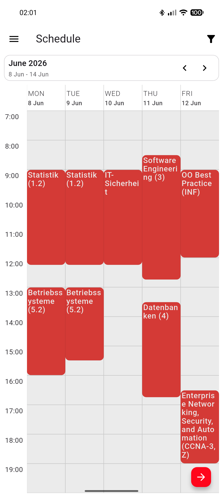
  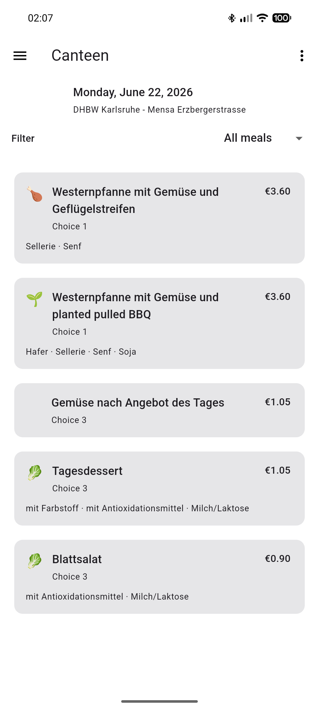
  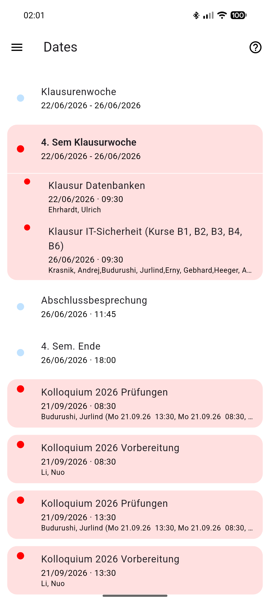
  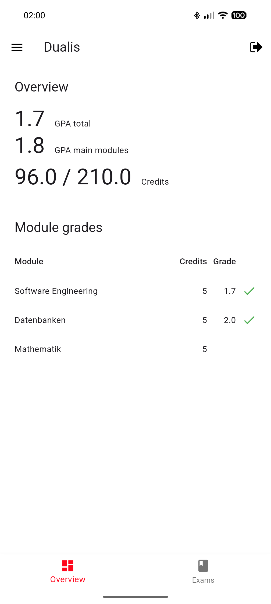
  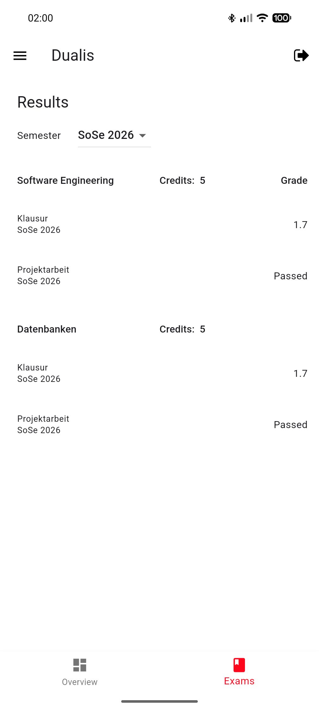

  <!-- Tablet (dark mode) screenshots -->
  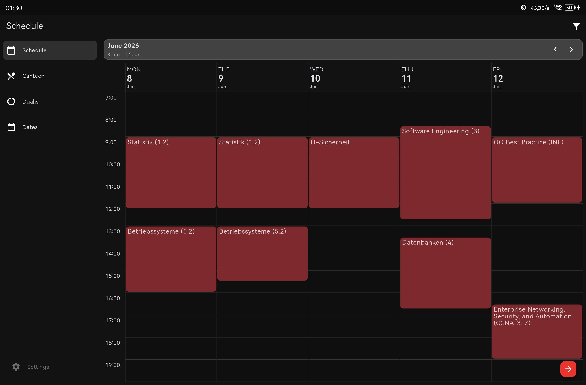
  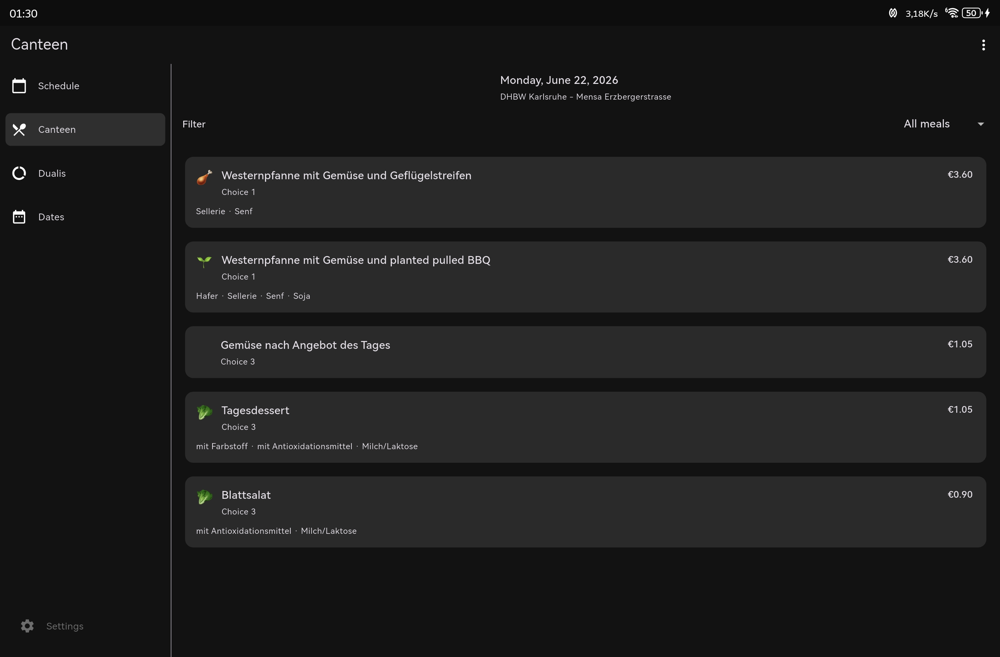
  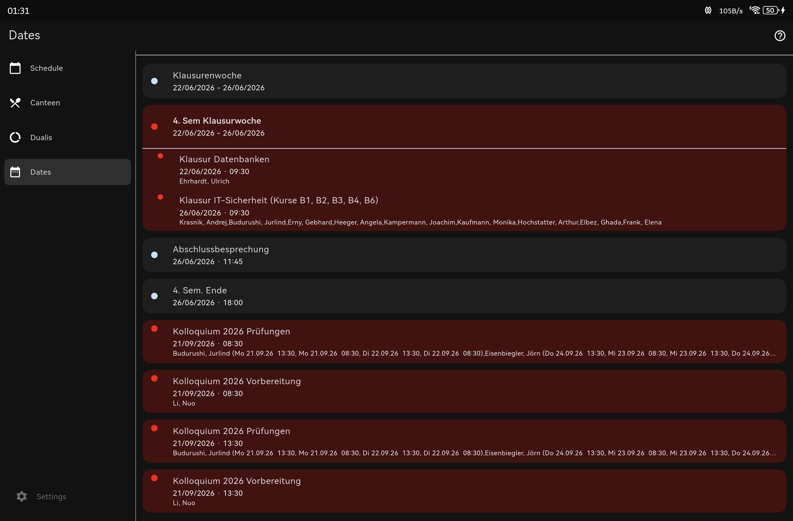
  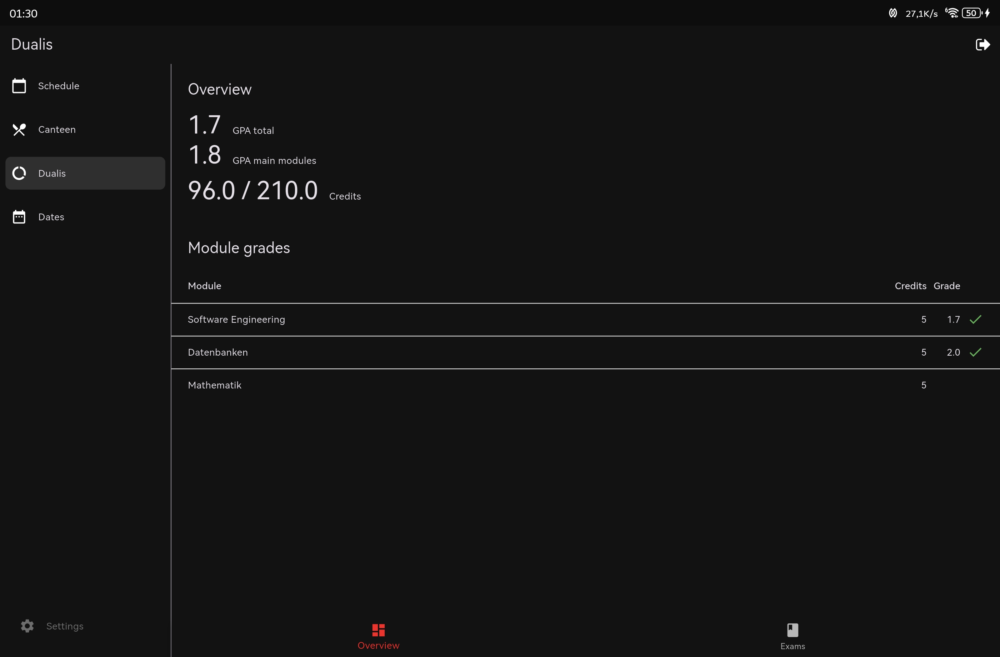
  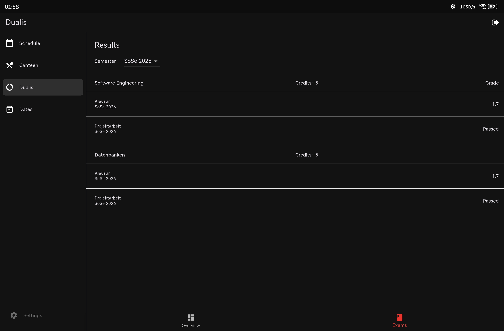

## Core features

### Schedule

DualMate gives you a clear weekly schedule that is easy to use during a busy university day.

- Browse your week and move between weeks quickly.
- See lectures, rooms, lecturers, online classes, exams, public holidays, and special events in one overview.
- Open schedule entries for more details.
- Filter schedule entries so your view stays focused.
- Keep using cached schedule data when the network is unreliable.
- Get local notifications for the next day and for schedule changes.
- Use schedule sources such as Rapla, Dualis, iCal calendars, and DHBW Mannheim schedules.

### Canteen

The canteen page helps you decide where and what to eat without leaving the app.

- View daily menus for your selected canteen.
- Switch between supported DHBW canteen locations.
- See meal names, categories, prices, notes, and allergens when available.
- Filter meals, including vegetarian, vegan, and no-pork options.
- Jump back to today when browsing other days.

Supported canteen locations include DHBW Karlsruhe, DHBW CAS / Heilbronn, DHBW Mannheim, DHBW Mosbach, DHBW Stuttgart, DHBW Ravensburg, DHBW Villingen-Schwenningen, DHBW Lörrach, DHBW Horb, DHBW Heidenheim, and DHBW Friedrichshafen.

### Dates

The Dates page keeps upcoming study-related events visible, not buried in a separate portal.

- See upcoming public holidays, exams, test weeks, and special events.
- Focus on future dates, past dates, or both.
- Use important events from your Rapla schedule.
- Use DHmine date information where available.
- Open date details when you need more context.

### Dualis integration

DualMate integrates with Dualis so your grades and exam results are always close by.

- View modules, exams, credits, grades, and pass status directly in the app.
- Keep an overview of your study progress without repeatedly opening Dualis in the browser.
- Save your Dualis login locally if you want the app to refresh your results automatically.

### Home-screen widgets

DualMate includes modern widgets for the information you want to see without opening the app.

- Schedule widget: shows upcoming classes and important schedule entries directly on your home screen.
- Canteen widget: shows the current canteen menu at a glance.
- Widgets are designed to fit into a modern Android home screen and stay useful throughout the day.

  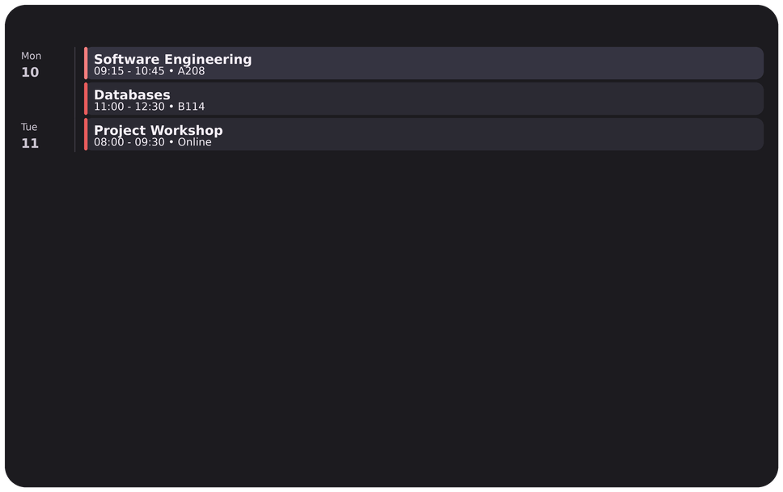
  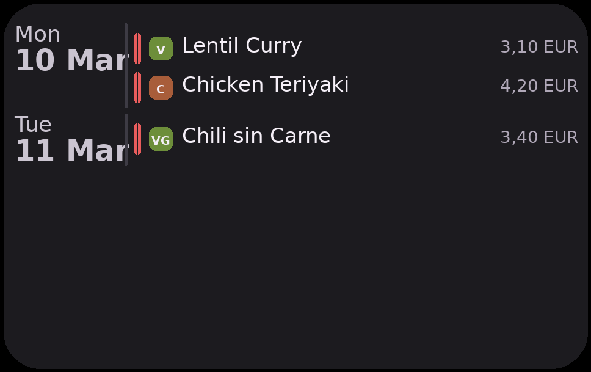

## Multiple locations and sources

DualMate is no longer limited to a single location or one fixed source of data. Depending on what your DHBW location provides, you can use the app with different schedule sources and canteen locations.

The app currently supports schedule setup through Rapla, Dualis, iCal calendars, and DHBW Mannheim course schedules. Canteen support covers several DHBW locations, so the app can be useful outside a single campus setup.

## Unofficial app

DualMate is an independent student project and is not an official DHBW app. The displayed data comes from the sources you configure or select in the app, so availability and correctness can depend on those external services.

DualMate was developed by FarisZR and is based on the original work of Benedikt Kolb.

## Feedback

Found a bug, missing location, broken schedule source, or feature idea? Open an issue on GitHub:

[github.com/FarisZR/DualMate/issues](https://github.com/FarisZR/DualMate/issues)

## License

DualMate is licensed under the GNU Affero General Public License v3.0. See [LICENSE](LICENSE) for details.