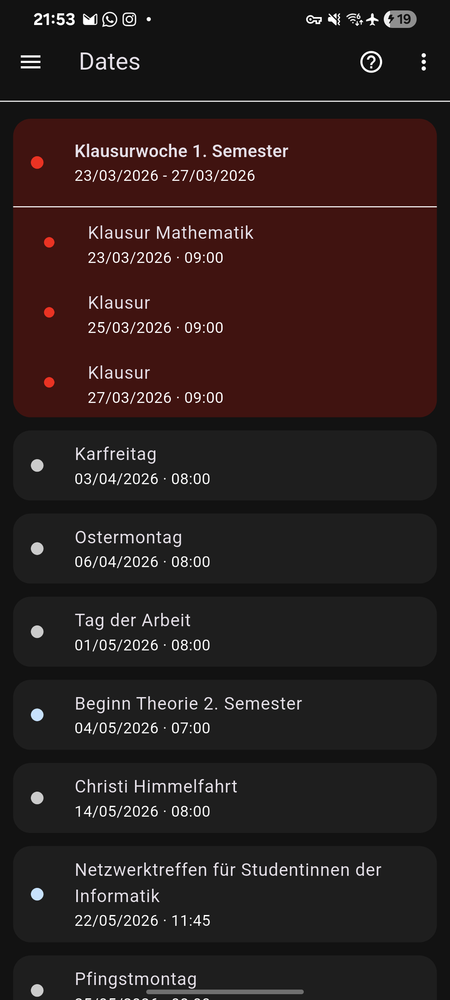
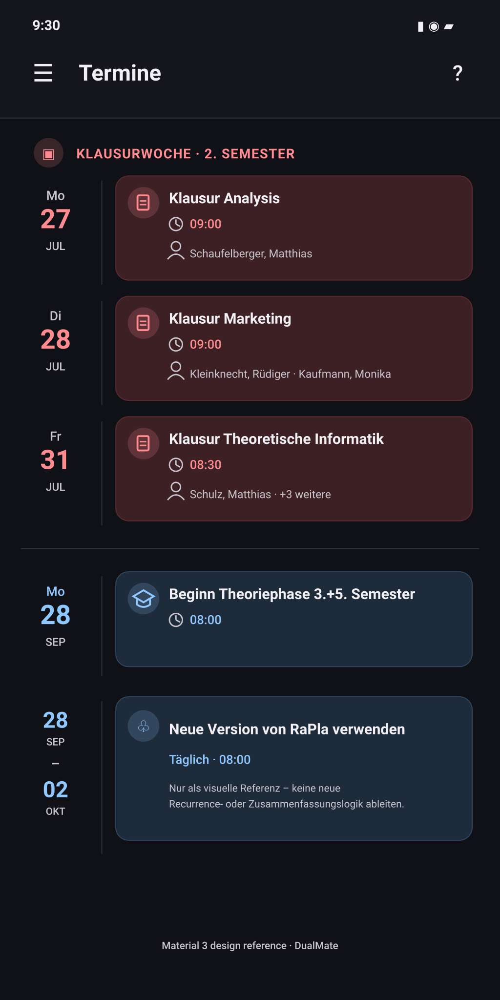
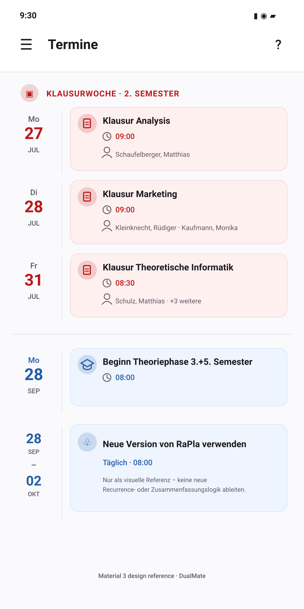

# Redesign Termine as a Material 3 academic agenda

## Goal

Replace the current large, bubble-like cards with a cleaner agenda-style layout inspired by Google Calendar and Android Material 3. The page remains a list of important academic dates rather than becoming a general calendar.

This is primarily a presentation redesign with a small cleanup of the presentation model. Preserve the existing Rapla loading, caching, pagination, refresh, export, grouping, and lazy-rendering behavior.

## Design references

### Current implementation



### Approved dark-mode direction



### Approved light-mode direction



The concept images define hierarchy, spacing direction, date-rail placement, and tonal treatment. They do not approve new recurrence behavior, automatic title shortening, invented lecturer counts, or changes to source classification.

In particular, the collapsed multi-day RaPla notice shown in the concepts must not be implemented unless recurrence semantics are introduced separately and safely.

## Research basis

This plan follows the current Flutter guidance available for the project SDK generation:

- Keep business/data conversion out of widgets and expose prepared UI state to views: [Flutter app architecture guide](https://docs.flutter.dev/app-architecture/guide).
- Keep the list builder lazy and provide an item count: [ListView.builder API](https://api.flutter.dev/flutter/widgets/ListView/ListView.builder.html).
- Base responsive decisions on available constraints rather than device labels: [Flutter adaptive layout guidance](https://docs.flutter.dev/ui/adaptive-responsive/general).
- Use a `ThemeExtension` for app-specific colors and implement `copyWith` and `lerp`: [ThemeExtension API](https://api.flutter.dev/flutter/material/ThemeExtension-class.html).
- Preserve large text scaling, screen-reader semantics, sufficient contrast, and 48x48 targets for any future interactive controls: [Flutter accessibility guidance](https://docs.flutter.dev/ui/accessibility).
- Use a custom row composition where `ListTile` does not fit the required layout: [ListTile API](https://api.flutter.dev/flutter/material/ListTile-class.html).
- Use the filled Material 3 card treatment for non-elevated grouped content: [Card API](https://api.flutter.dev/flutter/material/Card-class.html).
- Keep build work small, use lazy lists, avoid intrinsic layout, and minimize clipping/opacity: [Flutter performance best practices](https://docs.flutter.dev/perf/best-practices).
- Measure rendering in profile mode rather than debug mode: [Flutter rendering performance](https://docs.flutter.dev/perf/rendering-performance).
- Preserve child/render-object identity when builder order changes through an `O(1)` `findChildIndexCallback`: [ListView.builder API](https://api.flutter.dev/flutter/widgets/ListView/ListView.builder.html).

## Current behavior confirmed in the codebase

### Repeated-event merging already exists

`RaplaImportantEventsProvider.mergeImportantEntries()` currently:

- groups entries by exact title and `ScheduleEntryType`;
- merges consecutive daily occurrences into one range;
- keeps entries separate when there is a date gap;
- never merges exams;
- ignores unrelated events between occurrences because each title/type group is evaluated independently.

Example: the same special event on 28, 29, and 30 September becomes one 28-30 September range even if another event also occurs on 29 September.

### Why the RaPla migration notice is currently repeated

The red RaPla notice shown in the current screenshot is parsed as `ScheduleEntryType.Exam` because Rapla classifies important entries primarily by color. Exams are deliberately excluded from merging, so the notice remains one row per day.

Do not add a text-specific exception for this notice. Guessing meaning from arbitrary event titles would be fragile and could incorrectly merge real exams or unrelated notices.

### Exam-week sections already exist

`ImportantEventOrganizer` detects a `SpecialEvent` whose normalized title contains `klausurwoche`. It then places exams whose start date falls within that event's date range under an `ImportantEventSection` header.

The current section key is based on normalized title, year, and half-year. This can theoretically merge two identically named exam-week ranges in the same half-year. The redesign must replace that identity rule with a range-based identity.

### Existing performance structure is suitable

The page already uses:

- cached and refreshed Rapla windows;
- a prepared immutable `DatesRenderData` snapshot;
- `ListView.builder` and lazy row construction;
- flattening of large sections;
- scroll-position preservation;
- pull-to-refresh and automatic pagination;
- deferred initialization to protect drawer and startup responsiveness.

Retain these behaviors. At the time this plan was prepared, the relevant Dates suite passed 33 tests.

## Performance audit and mandatory guardrails

The redesign is safe to implement without a performance regression only if the following constraints are treated as requirements. They address the main risks introduced by a more structured row layout: extra list children, repeated formatting/sorting, per-row layout measurement, key remapping, and additional paint layers.

### Preserve the current rebuild boundary

Keep the existing `DatesRenderData` snapshot cache in `DateManagementPage`. Preparing structured rail and semantics strings must happen only when the underlying section/entry list identity, locale, or scheduled past-state version changes. Loading flags, footer state, scrolling, and ordinary ancestor rebuilds must reuse the existing snapshot.

Do not put available width, theme colors, or responsive icon visibility into `DatesRenderData`; those inputs would invalidate the complete data snapshot during layout/theme changes. Keep them in a small immutable layout specification passed to visible row widgets.

### Keep preparation linear and outside `build`

- Create each required `DateFormat` once per `DatesRenderData.prepare()` call and reuse it for every item.
- Do not sort again in `DatesRenderData`; it consumes the deterministic order produced by the organizer.
- Do not run regular expressions, title normalization, date formatting, semantics-label construction, or list scans inside row `build()` methods.
- Where normalized titles are needed for sorting/grouping, compute them once per event within that transformation pass and reuse the cached value. Never call `_normalizeTitle` from every comparator invocation.
- The flattened-item pass and key-to-index-map construction must each be `O(n)`.
- `findChildIndexCallback` must perform one map lookup. `indexWhere`, `indexOf`, or any scan of the rendered item list inside the callback is prohibited.

### One responsive calculation, not one per row

Use one `LayoutBuilder` around the Rapla list area. Read `MediaQuery.textScalerOf(context)` once at that same boundary. Resolve a const-like immutable `DatesAgendaLayoutSpec` from the available list width and text scale, including list padding, content width, rail width, gap, and whether category icons fit. Pass that specification to visible rows.

Do not add a `LayoutBuilder`, `MediaQuery` lookup, width calculation, or breakpoint decision to every row. If the 200% text-scale tests require a wider rail, derive that bounded adjustment in the page-level layout specification; do not use `FittedBox`, intrinsic measurement, or post-frame size probing per row.

### Single-pass row layout

The agenda row must use normal constraint-based `Row`, `Expanded`, `Padding`, and fixed-width rail primitives. Do not use:

- `IntrinsicHeight` or `IntrinsicWidth`;
- baseline measurement across the row;
- nested scrolling widgets or `shrinkWrap`;
- `GlobalKey` for measuring row sizes;
- post-frame size measurement followed by `setState`;
- `itemExtent`, `prototypeItem`, or `itemExtentBuilder`, because rows legitimately vary with content and text scaling.

To render the vertical rail divider without an intrinsic-height pass, place the divider/border on the event-column wrapper, whose height is already determined by the event surface. Do not wrap the row in `IntrinsicHeight`.

### Paint and layer budget

- Keep `ListView.builder`'s automatic repaint boundaries enabled. Do not add a manual `RepaintBoundary` around every row; this would duplicate layers.
- Set `addAutomaticKeepAlives: false`; the rows and headings are immutable and hold no state that should survive disposal.
- Preserve the existing `_importantEventsCacheExtent` / `scrollCacheExtent` value initially. Do not increase it to compensate for the new row design without profile evidence.
- `Card.filled` must use zero elevation, zero external margin, and `clipBehavior: Clip.none`. Rounded color is painted by the shape; do not wrap each row in `ClipRRect`.
- Do not introduce `Opacity`, blur, gradients requiring offscreen layers, `ShaderMask`, `ColorFilter`, `ClipPath`, or `Clip.antiAliasWithSaveLayer`. Use resolved colors with alpha directly.
- Do not add per-row animations, controllers, timers, hover effects, or autonomous scrolling text.

### List identity and pagination stability

- Preserve the existing list/controller identity and the keys `rapla_dates_list` and `dates_rapla_first_item`; the integration/performance harness depends on them.
- Store stable item keys and the immutable key-to-index map in the prepared snapshot. Do not recreate random, timestamp-based, or index-only identities after pagination.
- Appending/replacing a Rapla window must not replace the `ScrollController`, change the list key, jump the scroll offset, or invalidate existing item identities because unrelated footer/loading state changed.
- Keep the loading/retry/end footer outside the prepared Rapla item map, as it is transient page state.

### Scope control

Do not modify deferred initialization, refresh scheduling, paging-window size, provider I/O, cache reads, loading-indicator timing, or property-notification boundaries as part of this visual redesign. Any necessary change to those paths requires separate evidence and explicit PR justification.

Flutter's official performance guidance specifically recommends lazy builders, avoiding intrinsic layout passes, controlling `build()` cost, minimizing opacity/clipping, and measuring in profile mode. The implementation must follow those constraints and verify them on the connected Android device.

### Audited pre-implementation baseline

A three-run profile baseline was captured from commit `3129c50` on the connected Samsung SM-G996B with all Android animation scales at `1.0` and deterministic offline fixtures. The code under test is the current Dates implementation; the only subsequent working-tree changes are this documentation audit.

| Scenario | Combined p95 | p99 | Worst | >16.67 ms | >33 ms | Consecutive >8.33 ms | Validity |
|---|---:|---:|---:|---:|---:|---:|---|
| `dates_cold_launch_to_populated` | 9.010 ms | 13.459 ms | 13.920 ms | 0 | 0 | 2 | 3/3 final state |
| `drawer_close_to_dates_and_populated_content` | 4.196 ms | 8.892 ms | 8.892 ms | 0 | 0 | 1 | 3/3 progression, no drops |
| `dates_cold_loaded_list_scroll` | 1.938 ms | 3.488 ms | 3.862 ms | 0 | 0 | 0 | 3/3 scroll progression |

Local machine-readable outputs:

- `build/perf-dates-redesign-baseline/summary.json`
- `build/perf-dates-redesign-diagnostic-baseline/summary.json`

These numbers are the current audit reference, not a reason to skip the required same-device baseline/candidate comparison in Phase 5. Environmental drift or a different device still requires a fresh baseline from the implementation branch's base commit.

## Intended data behavior

### Keep as-is

- Genuine multi-day entries remain one range.
- Consecutive same-title, same-type non-exam entries may remain merged by the existing provider logic.
- Exams remain individual entries.
- Exam-week headers continue to group exams inside their date range.
- Unrelated events remain independent and chronologically visible.
- A range is positioned by its start date and does not reserve or hide the dates it spans.

### Do not add in this issue

- Generic recurrence detection.
- Title-based special cases for the RaPla migration notice.
- Automatic wording changes or shortening of arbitrary event titles.
- Invented labels such as `Täglich` when recurrence is not represented in the model.
- Invented lecturer counts such as `+3 weitere` while lecturers remain one unstructured string.
- A new calendar database or persistence schema.
- Changes to Rapla parsing colors or schedule notification behavior.
- New event-detail navigation, expansion, editing, or tap actions.

### Future-safe recurrence design

If recurrence summarization is added later, retain the original occurrences and create a separate presentation-level series summary. A summary must not replace or mutate the underlying events. This allows an event occurring between repeated dates to remain correctly ordered and visible.

## Fixed implementation decisions

The decisions in this section are final for this issue. The implementation agent should not invent alternatives without discussing them in the pull request.

### 1. Section model and invariants

Add an explicit section kind with exactly these initial values:

- `standalone`
- `examWeek`

`ImportantEventSection` invariants:

- `standalone`: `header` is null and `events` contains exactly one event.
- `examWeek`: `header` is non-null and `events` contains zero or more exams.

An exam-week marker with no matching exams remains an `examWeek` section. Render the heading with its date-range subtitle; do not drop it and do not convert it into a normal blue event card.

The organizer, not the UI, decides section kind. Widgets and render-data code must not search titles for `klausur`, inspect source colors, or infer semantic grouping.

### 2. Exam-week identity

Use this semantic identity for an exam-week section:

- normalized title;
- start calendar day;
- end calendar day.

Ignore time-of-day in the identity. Two duplicate markers for the same title and exact calendar range may be deduplicated. Two identically titled ranges with different start or end days remain separate, even within the same year or half-year.

### 3. Deterministic ordering

Use one shared event comparator wherever a deterministic sort is required:

1. start instant ascending;
2. end instant ascending;
3. normalized title ascending;
4. professor string ascending;
5. `ScheduleEntryType.index` ascending only as a final deterministic tie-breaker.

Final sections are ordered by:

1. section anchor start (`header.start` for `examWeek`, event start for `standalone`);
2. `examWeek` before `standalone` when anchor starts are identical;
3. anchor end;
4. normalized title.

Sort only at explicit boundaries: merged provider output once, organizer input once when it cannot rely on provider order, and final sections once. Filtering exams from an already sorted event list must preserve that order and must not sort each section again. `DatesRenderData` must not sort.

Exams inside an exam-week section therefore inherit the shared event order.

A multi-day row appears once at its start position. Events starting during that range still appear later according to their own start time.

### 4. Flattened list item contract

Replace the current mixed small-card/large-section strategy with one fully flattened immutable item stream.

The Rapla portion of `DatesRenderData` exposes these visible item types:

- section heading item;
- agenda event-row item.

The loading/retry/end footer remains owned by `DateManagementPage` as it is today.

Every section heading and every event row is a separate `ListView.builder` child. Remove the `maxEagerRowsPerSection` behavior and the optimization that renders a small section as one card containing multiple children. That visual/container model conflicts with the approved standalone heading and row design.

Each flattened item has a stable identity key prepared outside `build`. Use stable widget keys. Because refresh and pagination can change item ordering, provide a key-to-index lookup and `findChildIndexCallback` so Flutter can remap existing children safely.

Do not use `itemExtent`, `prototypeItem`, `IntrinsicHeight`, `IntrinsicWidth`, nested scroll views, or `shrinkWrap`; row heights vary with title length and text scaling.

### 5. Same-day date-rail suppression

Date-rail suppression is presentation-only and never merges events.

Rules:

- A section heading resets date grouping.
- The first event row after a section heading always shows its date rail.
- A single-day event may hide its date text only when the immediately preceding visible item is another single-day event row with the same start calendar day.
- The blank rail remains allocated and retains its divider so cards stay aligned.
- A multi-day event always shows its full range rail.
- The event immediately after a multi-day row always shows its own rail, even if it shares the same start day.
- Suppression never crosses a section heading.

### 6. Multi-day display semantics

A multi-day entry is displayed only as the literal range represented by `start` and `end`.

Do not infer recurrence, frequency, or daily timing.

- Same month/year: display both day numbers with one month, for example `27–31 JUL`.
- Different months, same year: stack both endpoints, for example `28 SEP` / `02 OKT`.
- Different years: stack both endpoints and include the full year with each endpoint.
- Multi-day event surfaces do not show an inferred `Täglich` label.
- Preserve current behavior by not showing time-of-day for multi-day entries. The current model cannot distinguish a continuous range from repeated daily occurrences reliably enough to present a truthful time subtitle.

For exam-week section headings, show a compact localized range subtitle beneath the title using the same prepared range information.

### 7. Locale formatting

All visible and semantic date strings are prepared in `DatesRenderData.prepare()` with `intl`; widgets do not instantiate `DateFormat`.

Visual rail format:

- German weekdays: `Mo`, `Di`, `Mi`, `Do`, `Fr`, `Sa`, `So`.
- English weekdays: localized short values such as `Mon`, `Tue`.
- Months: localized `MMM` output converted to uppercase, for example `JUL`, `SEP`, `OKT`.
- Day numbers: two digits only for range endpoints when needed for alignment; single-day large numbers remain unpadded (`7`, not `07`).
- Year: omit for dates in the current calendar year; show the full four-digit year for other years and for both endpoints of a cross-year range.
- Time: localized 24-hour `Hm` formatting, matching current app behavior.

Do not hardcode German text into widgets. Any accessibility connector words or range phrases must be localized in the existing German and English resources.

### 8. Interaction behavior

Rapla agenda rows and exam-week headings remain non-interactive in this issue.

- No `onTap`, `InkWell`, ripple, hover cursor, expansion, or detail sheet.
- Do not mark rows as buttons in semantics.
- Do not add no-op callbacks solely to obtain Material effects.
- The existing app-bar help action and pull-to-refresh remain unchanged.

If interaction is added in a future issue, the complete surface must become the target, use Material ink on the same shape, and meet the 48x48 minimum target requirement.

## Proposed presentation model

### `ImportantEventSection`

Add the explicit section kind and enforce the invariants above with constructor assertions and tests.

### `ImportantEventRenderData`

Replace the single `dateText` dependency for Rapla rows with structured, immutable prepared values:

- stable item/event key;
- localized weekday;
- start day;
- start month;
- optional start year;
- optional end day/month/year;
- single-day versus range flag;
- localized time text for single-day timed entries;
- event category;
- surface/rail display decisions;
- complete localized semantics label;
- past state.

Keep the underlying `ImportantEvent` reference where existing export and tests need it.

### Agenda item render data

The flattened event-row item additionally contains:

- section identity;
- whether the visible date text is suppressed;
- spacing role: first, same-day continuation, normal date change, or after section heading;
- category used to resolve theme tokens.

Section-heading render data contains:

- stable section key;
- title;
- compact localized range subtitle;
- complete localized semantics label;
- exam-week category.

Formatting and display-policy calculation remain in render preparation, not widgets.

## Exact UI specification

### Overall list width and responsive behavior

Use exactly one `LayoutBuilder` around the Rapla list area and base decisions on its available width. Resolve a `DatesAgendaLayoutSpec` there and pass it down; do not repeat responsive calculations in individual rows.

- Width below 600 logical pixels:
  - list horizontal padding: 16;
  - list vertical padding: 8;
  - date rail width: 64;
  - rail-to-surface gap: 12.
- Width 600 logical pixels and above:
  - list horizontal padding: 24;
  - list vertical padding: 12;
  - date rail width: 72;
  - rail-to-surface gap: 16;
  - center the list content with a maximum width of 840.

Remain a single lazy list at all widths. Do not introduce a tablet grid.

When the event surface receives less than 260 logical pixels of width, omit the category icon slot to preserve title readability. This decision is based on local constraints, not device type.

### Section heading

A section heading is a full-width row aligned to the event column, with the date-rail area left empty.

- top spacing: 24, except the first item uses 8;
- bottom spacing: 12;
- category icon: 20 inside a 36x36 tonal circle;
- icon-to-text gap: 12;
- title: `titleSmall`, weight 600, maximum 2 visual lines;
- range subtitle: `labelMedium`, `onSurfaceVariant` or the approved exam foreground with reduced emphasis;
- no enclosing card;
- mark as an accessibility heading.

Do not transform or shorten the source title. Preserve the full title in the semantics label if visual text is ellipsized.

### Agenda event row

Use a custom `Row`/`Column` composition rather than `ListTile` because the fixed date rail and responsive icon removal are not a natural `ListTile` layout.

Date rail:

- right-side 1 logical-pixel divider using `colorScheme.outlineVariant`;
- divider remains visible for suppressed same-day rails;
- weekday: `labelMedium`;
- day: `headlineLarge`, weight 500;
- month/year: `labelMedium` and `labelSmall`;
- rail text uses the category accent for exams and special events, and `onSurfaceVariant` for neutral events;
- date text is excluded from child semantics because the row supplies one complete semantics label.

Event surface:

- use `Card.filled` with `semanticContainer: false`, `margin: EdgeInsets.zero`, `elevation: 0`, and `clipBehavior: Clip.none`; the outer row semantics node owns accessibility output;
- corner radius: 12;
- no shadow;
- no outline in the normal state;
- horizontal padding: 16;
- vertical padding: 14;
- category icon: 20 inside a 36x36 tonal circle when space permits;
- icon-circle fill: blend the category accent at 12% over the category container; icon color is the category accent;
- icon-to-content gap: 12;
- title: `titleMedium`, weight 600, maximum 3 visual lines with ellipsis;
- time: `bodyMedium`;
- lecturer: `bodySmall`, one line with ellipsis, matching existing behavior;
- retain the complete untruncated title and lecturer in the semantics label.

Spacing between event rows:

- same-day continuation: 8;
- different date: 12;
- first row after a section heading: 0 beyond the heading's bottom spacing;
- after a multi-day row: 12.

Past entries retain the existing strike-through behavior unless visual testing shows insufficient readability. Do not reduce opacity so far that contrast falls below the accessibility target.

### Category visual mapping

- Exam rows and exam-week headings: exam tokens.
- `SpecialEvent`: special-event tokens.
- `PublicHoliday`, `Unknown`, and any unsupported category: neutral Material color-scheme tokens.

Do not use `errorContainer` for exams; exams are important, not errors.

## Dates-specific theme extension

Create a dedicated file under `lib/date_management/ui/theme/`, for example `dates_agenda_theme.dart`.

Define `DatesAgendaTheme` as a `ThemeExtension` with these required fields:

- exam container;
- exam foreground;
- exam accent;
- special-event container;
- special-event foreground;
- special-event accent.

Implement a const constructor, `copyWith`, and `lerp`, and register light/dark instances in `ColorPalettes.buildTheme`.

Approved initial colors:

| Token | Light | Dark |
|---|---:|---:|
| Exam container | `#FBE9E9` | `#3A1B1D` |
| Exam foreground | `#3B0A0A` | `#FFDAD6` |
| Exam accent | `#B3261E` | `#FFB4AB` |
| Special container | `#E9F2FF` | `#172A45` |
| Special foreground | `#0B1F3A` | `#D7E3FF` |
| Special accent | `#2E5FA8` | `#A9C7FF` |

These pairs exceed the 4.5:1 text contrast target. Neutral rows use the active `ColorScheme`:

- container: `surfaceContainerHigh`;
- foreground: `onSurface`;
- accent/secondary text: `onSurfaceVariant`.

Do not hardcode these colors inside row widgets.

## Accessibility and semantics

### Event rows

Represent each event row as one semantics container using a prepared localized label and `excludeSemantics: true`, so visual child text and icons are not announced twice.

The localized label includes, in natural reading order:

1. full date or range;
2. title;
3. time when available;
4. lecturer when available;
5. past-state description when applicable.

Exclude the decorative category icon and duplicate visual date-rail text from semantics. Do not expose a button or tap action.

### Section headings

Expose each exam-week heading as a semantics header with its title and range, using `header: true`, `headingLevel: 2`, and `excludeSemantics: true`. Do not add custom sort keys because the semantics tree already follows list order.

### Scaling and contrast

- Do not cap or override the user's `TextScaler`.
- Layout must remain usable at 200% text scaling and with increased display size.
- Verify text/background contrast at 4.5:1 or better.
- Verify TalkBack reading order matches the visual item order.
- Use `SemanticsDebugger` or widget semantics assertions during development.

## Files expected to change

### Business/model

- `lib/date_management/model/important_event_section.dart`
- `lib/date_management/business/important_event_organizer.dart`
- optionally a shared deterministic comparator helper in the date-management feature.

### Presentation preparation

- `lib/date_management/ui/widgets/dates_render_data.dart`

### UI

- `lib/date_management/ui/date_management_page.dart`
- remove or substantially replace the visual responsibilities of:
  - `important_event_section_card.dart`
  - `important_event_section_row.dart`
  - `important_event_tile.dart`
- add focused widgets for:
  - section heading;
  - date rail;
  - event surface;
  - agenda row.

Delete obsolete widgets after all references and tests are migrated; do not leave parallel unused implementations.

### Theme/localization

- add `lib/date_management/ui/theme/dates_agenda_theme.dart`;
- register it in `lib/common/ui/colors.dart`;
- update German and English localization resources for semantics and any required range connector text.

## Test-first implementation plan

### Phase 1: Lock down organizer and merge behavior

Before UI changes, add or update tests for:

- exams grouped under a valid exam-week range;
- exams outside the range remaining independent;
- two exam weeks with the same title in one half-year remaining separate when their ranges differ;
- duplicate markers for the exact same range deduplicating safely;
- an exam-week marker with zero exams remaining visible as an `examWeek` section;
- repeated non-exam entries merging only across consecutive days;
- a date gap splitting repeated entries;
- an unrelated event between repeated dates not being lost;
- exam entries never merging;
- the red RaPla migration notice remaining separate while classified as an exam;
- deterministic ordering for equal start times.

### Phase 2: Replace render-data contract

Add tests for:

- explicit section-kind propagation;
- fully flattened item output for both small and large sections;
- stable item keys and key-to-index lookup;
- German and English weekday/month formatting;
- current-year and non-current-year display;
- same-month, cross-month, and cross-year ranges;
- timed and all-day single-day entries;
- no time or recurrence label for multi-day entries;
- same-day rail suppression rules;
- suppression reset after section headings and multi-day rows;
- past-state refresh scheduling remaining correct;
- complete semantics labels preserving untruncated content.

### Phase 3: Theme extension

Add unit/widget tests for:

- light and dark `DatesAgendaTheme` registration;
- `copyWith` and `lerp` behavior;
- category-to-token mapping;
- no direct domain color constants remaining in agenda widgets.

### Phase 4: Agenda widgets

Widget-test:

- light and dark themes;
- 320, 360, 600, and tablet-width constraints;
- centered max-width layout on large screens;
- category icon omission below the 260-width event-surface threshold;
- text scaling at 100%, 150%, and 200%;
- long event names and lecturer strings;
- multiple events on one date;
- exam sections with zero, one, and many exams;
- same-month, cross-month, and cross-year ranges;
- visual rail continuity on suppressed rows;
- semantics heading and row labels;
- no button/tap semantics;
- lazy construction of a large flattened list.

### Phase 5: Page regression and performance

Before implementation, capture a same-device profile baseline from the unmodified base commit. After implementation, repeat the exact command with the same phone, refresh rate, animation scales, fixture mode, and run count:

```bash
PERF_RUNS=3 \
PERF_TARGETS='dates diagnostic' \
PERF_PROFILE_MODE=ranking \
PERF_OUTPUT_ROOT=build/perf-dates-agenda-<baseline-or-candidate> \
scripts/run_cold_navigation_perf_suite.sh
```

Also run:

- all `test/date_management/**` tests;
- `flutter analyze`;
- `integration_test/date_management_startup_responsiveness_test.dart`;
- the existing cold-navigation profile harness in profile mode on the connected device.

The before/after comparison uses three-run medians, not a single run. For `dates_cold_loaded_list_scroll`:

- final state and scroll-position progression must succeed in every run;
- no frame may exceed 33 ms;
- the number of frames over 16.67 ms may not exceed the baseline median by more than one;
- combined p95 may not exceed the larger of baseline + 1.5 ms or baseline x 1.15;
- the longest sequence over the 8.33 ms 120 Hz budget may not exceed the larger of baseline or two frames.

For Dates cold navigation/population:

- no frame may exceed 50 ms;
- combined p95 and worst-frame time may not exceed the larger of baseline + 3 ms or baseline x 1.20;
- no new failed animation/progression check is allowed; preserve the existing harness keys so this result is meaningful.

If a threshold fails, do not explain it away as normal variance. Run one additional three-run batch. If the second candidate batch still fails, collect a trace with `PERF_PROFILE_MODE=diagnostic`, inspect it, and fix or revert the responsible design choice before opening the PR.

Inspect at least one diagnostic trace or DevTools profile session for:

- unexpected intrinsic layout events;
- repeated date formatting or normalization in visible row builds;
- excessive widget rebuilds while scrolling;
- `saveLayer`/offscreen-layer events caused by the new surfaces;
- an unexpected increase in retained row/layer count.

Functional checks remain:

- stable scroll position while additional Rapla windows load;
- no overflow at large text scales;
- correct colors and contrast in both themes;
- pull-to-refresh and pagination remain functional;
- refresh does not reorder equal-time entries nondeterministically;
- no duplicate or missing items at pagination window boundaries;
- no new autonomous animations or timers per visible row.

## Acceptance criteria

- The Dates page matches the approved agenda/date-rail direction in light and dark mode.
- The implementation follows every fixed decision in this plan or documents an approved deviation in the pull request.
- Exam weeks appear as standalone section headings with independent exam rows.
- Exam-week headings remain visible when no exams are present.
- Existing safe merge behavior is preserved; no title-specific RaPla workaround is introduced.
- The repeated RaPla notice remains separate unless its actual parsed type permits existing safe merging.
- Same-day and intervening events remain independently visible and correctly ordered.
- Multi-day rows show literal ranges only and do not invent recurrence labels.
- The list is fully flattened and lazily constructed at every section size, with no per-row intrinsic measurement or responsive `LayoutBuilder`.
- Loading, caching, refresh, pagination, export, and scroll behavior do not regress.
- Light/dark theme tokens come from `DatesAgendaTheme`, not widget hardcoding.
- The UI remains usable at 320 logical pixels and 200% text scaling.
- TalkBack semantics are intelligible and contain complete, untruncated event information.
- All Dates tests, analyzer checks, integration tests, and profile-device verification pass.
- The before/after three-run profile comparison satisfies every quantitative performance gate in Phase 5.

## Pull-request evidence required

The implementation pull request must include:

- screenshots of light and dark mode on a phone-sized viewport;
- at least one 320-wide screenshot or golden/test artifact;
- a 200% text-scaling screenshot;
- a screenshot showing an exam week and its exams;
- a screenshot showing repeated RaPla notice rows remaining separate;
- test command results;
- `flutter analyze` result;
- baseline and candidate profile output paths plus the Dates scenario median comparison;
- profile/device verification notes, including the quantitative performance gates and any inspected trace findings;
- a short list of any deliberate deviations from this plan.

## Relationship to the older plan

The February 2026 Material 3 plan delivered important groundwork: empty states, tonal cards, dispose guards, and lazy rendering. This document supersedes its remaining visual direction. Completed infrastructure from that plan must be retained rather than reimplemented.
